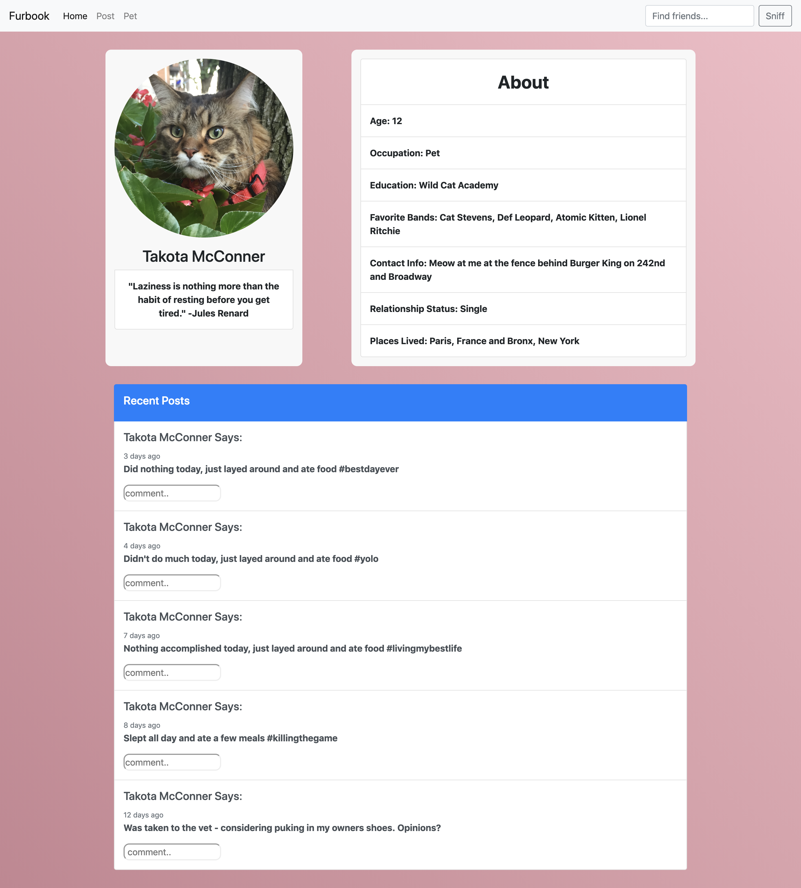

# HTML to React Refactor



## The Goal
Looks like Furbook has really taken off in popularity among the world's pets! The only problem is, our website has been slow to scale and our valued pet users are complaining about how long it takes to load other pets profiles. As a result, we need to refactor the profile section of the website, which is written in plain HTML, into a React web page.


## Getting Started

1. Clone this repository using `git clone`
2. `cd` into the `html-to-react-refactor` folder
3. `npm install`
4. `npm start`

Once everything is installed and you have started up the website, check out how the website looks so far.

## The Lab

Don't worry, the web page should be blank. There is nothing to show yet: this is just a boiler-plate. It is going to be your job to port the HTML that has already been written into this React project.

The original HTML and CSS files can be found in the folder labeled furbook-profile-page. Use this code to build the new-and-improved React version of this web page.

#### 1. The Navbar
The first thing we will want to do is copy the navbar over to our React project. Copy the code for the navbar from the original website and place it inside of the file for the Navbar component (you can find it in the components folder).

```html
<nav class="Navbar navbar-expand-lg navbar-light bg-light">
  <a class="navbar-brand" href="#">Furbook</a>
  <button class="navbar-toggler" type="button" data-toggle="collapse" data-target="#navbarTogglerDemo02" aria- controls="navbarTogglerDemo02" aria-expanded="false" aria-label="Toggle navigation">
    <span class="navbar-toggler-icon"></span>
  </button>

  <div class="collapse navbar-collapse" id="navbarTogglerDemo02">
    <ul class="navbar-nav mr-auto mt-2 mt-lg-0">
      <li class="nav-item active">
        <a class="nav-link" href="#">Home <span class="sr-only">(current)</span></a>
      </li>
      <li class="nav-item">
        <a class="nav-link" href="#">Post</a>
      </li>
      <li class="nav-item">
        <a class="nav-link" href="#">Pet</a>
      </li>
    </ul>
    <form class="form-inline my-2 my-lg-0">
      <input class="form-control mr-sm-2" type="search" placeholder="Find friends..." />
      <button class="btn btn-outline-secondary my-2 my-sm-0" type="submit">Sniff</button>
    </form>
  </div>
</nav>
```

If you have done this correctly, you should see a navbar pop up on the web page.

#### 2. The Profile Picture
The next step will be to move the profile picture box into our react project. Copy the code for the profile picture box and add it to the file for the picture box component.

>If nothing happens after to have copied the code, don't forget to add the component to your app in the App.js file.

It shouldn't look quite right, there is still some changes to be made. First, we need to add the css from the original style.css file to our React project.
Copy and paste the css for the picture box into the css file associated with the picture box.

Second we need to change how we imported the profile image to the web page from the original site. Change the following line of code:

```HTML        

```

to:

```HTML        

```

We will discuss how to import pictures into a React project in the next lecture, but for now this should do the trick.

#### 3. The About Me Section
While the file for the about me component has been created, there is very little code provided.

You will need to create the actual function for the component, export it, and then import it into the App.js file.

Oh, and don't forget to copy the CSS from the original website as well.

#### 4. Posts Section
You are on your own now. You will need to create your own file for this component and complete the necessary steps to add the component to the web page.

## Extension
Create your own component for the profile page. Look for inspiration from other social media sites. Perhaps there should be a section for friends each pet has, or interest groups they have joined. It's up to you!
